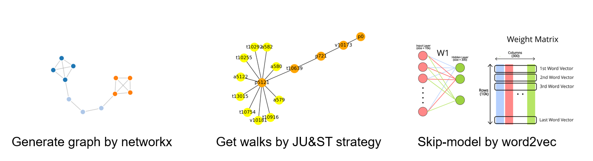
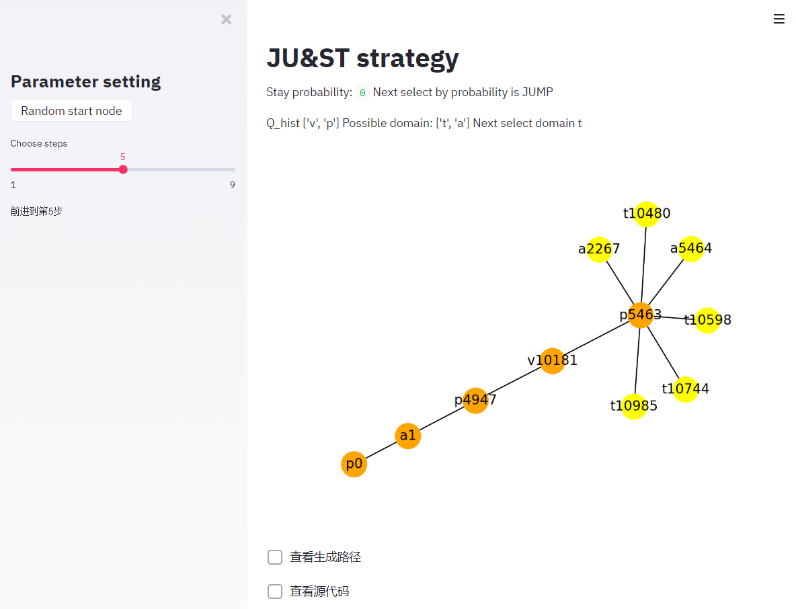
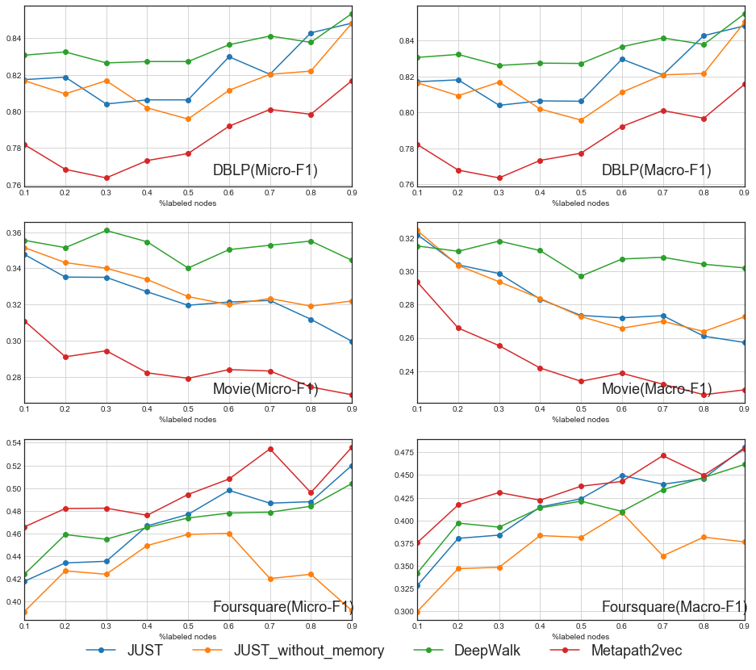
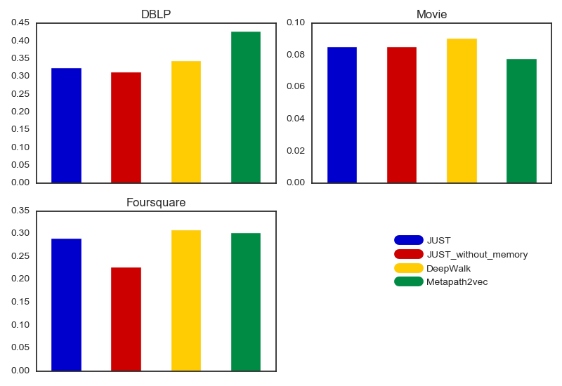

# **JU&ST strategy** 

### 复现论文

**JUST - **Are Meta-Paths Necessary? Revisiting Heterogeneous Graph Embeddings

**Core idea:** Achieve Balance without meta-paths




### 代码文件

model.ipny ——模型训练过程代码

evaluation.ipynb ——向量评估过程代码

src/main.py ——JUST模型训练脚本

src/show.py —— JUST策略Web可视化Demo


### 脚本使用方法

```cmd
python src/main.py 
--input # 存储图数据的文件路径
--output # 模型结果输出路径
--dimensions dimensions # 训练向量的维度 
--walk_length walk_length # 每次行走的长度
--num_walks num_walks # 每个节点行走的次数
--window_size window_size # 训练的窗口大小
--alpha # 超参数a的大小
```

~~~cmd
# example
python src/main.py --input 'Datasets/DBLP/dblp.edgelist' --output 'Vectorfile/JUST/test.embeddings' --dimensions  128 --walk_length 100 --num_walks 10 --window_size 10 --alpha 0.5
~~~


### Web Demo使用方法

~~~cmd
# 若未安装
# pip install streamlit 
streamlit run src/show.py
~~~


### Web Demo效果展示




### 评估结果展示

* #### 分类效果




* #### 聚类效果



